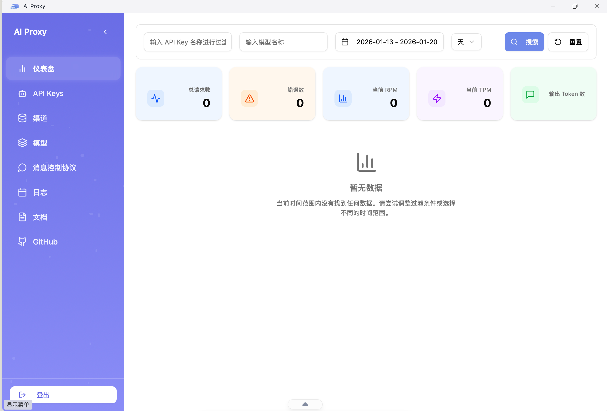
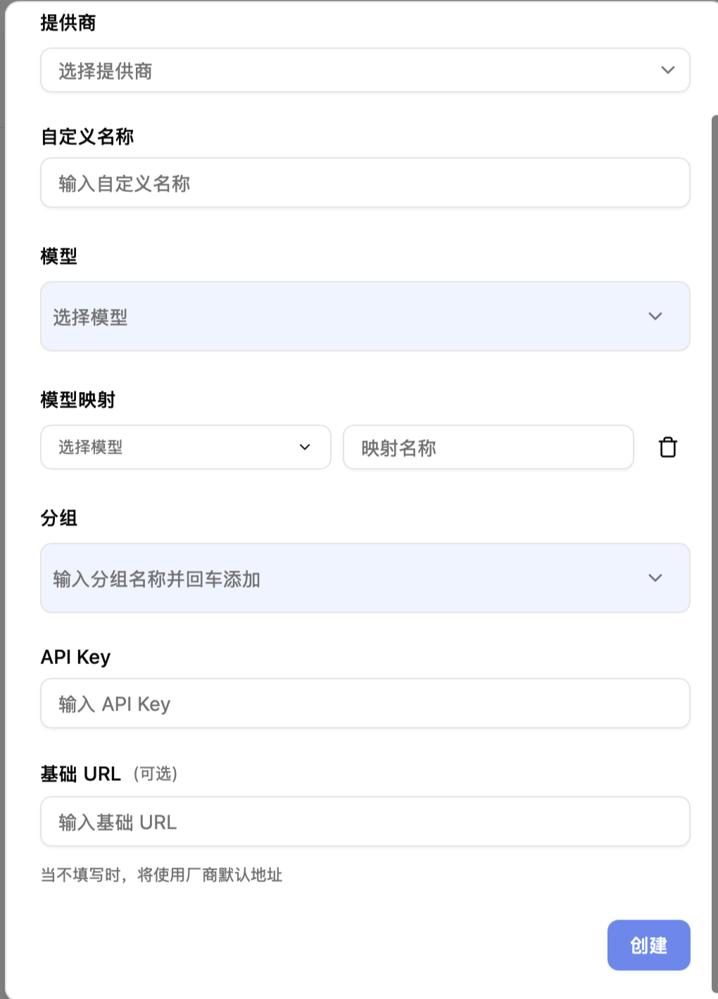
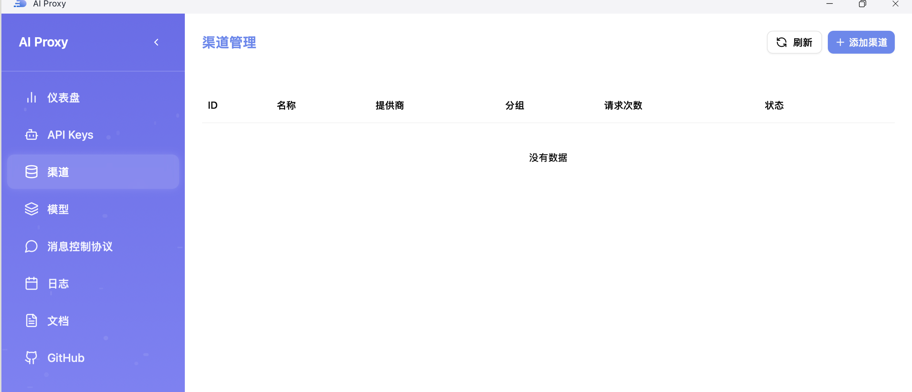

## 进入渠道管理

在 AI Proxy 中选择【渠道管理】，点击【添加渠道】。

## 添加渠道

点击【添加渠道】后进入配置页。

填写渠道信息并保存。

1. 选择提供商为 `openai`。
2. 填写渠道名（便于区分环境或用途）。
3. 添加模型到渠道（可按需添加多个模型）。
4. 填写 API Key（妥善保管，避免泄露）。
5. （可选）填写 URL 地址。如接入 OpenAI 兼容服务，通常需要添加 `/v1` 后缀。
