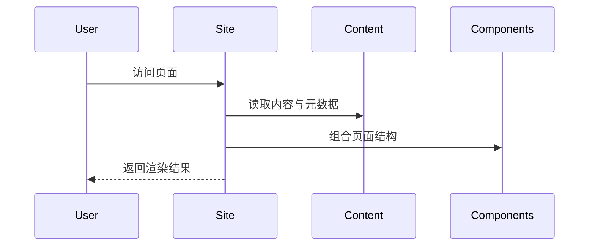

# 架构设计

## 总体架构
```mermaid
flowchart TD
    U[用户] --> N[Next.js 文档站点]
    N --> C[组件与页面]
    N --> D[内容资源 (MDX/JSON)]
    N --> S[静态资源]
```

## 技术栈
- **前端:** Next.js (App Router) / React / TypeScript
- **内容:** MDX、Markdown、JSON
- **静态资源:** 图片、字体、图标

## 核心流程


## 重大架构决策
完整的ADR存储在各变更的how.md中，本章节提供索引。

| adr_id | title | date | status | affected_modules | details |
|--------|-------|------|--------|------------------|---------|
